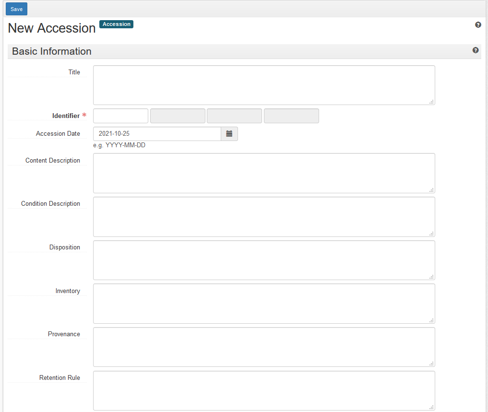
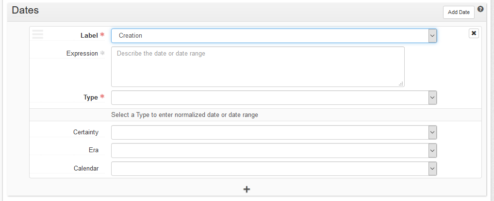

# Creating an Accession Record in ArchivesSpace

The accession record provides a summary of each accession. It includes a brief content description, disposition information, donor restrictions, technical information, and any relevant notes about the accessioning process. This draws on information from the donor and contextual information from the collection's archivist or processor. It also draws from the digital archivist's initial observations and work with the material. This record is supplemented by a copy of the bag manifest (saved outside the bag in the accession folder) and a step-by-step preservation log (saved in the same place) that provides a detailed record of accessioning actions.

Digital materials received as part of a hybrid collection should have their own accession number and accession record. This allows for easier tracking of digital accessions, more detailed metadata collection, and separate processing planning. The relationship between the analog and digital materials is established through their direct link in the "Related Accessions" field as well as through their shared link to the collection's resource record. 

## ArchivesSpace Accession Record

Create a new accession record by navigating to the ArchivesSpace home screen. Select the appropriate repository in the upper righthand corner. 

On the lefthand side, select Create > Accession.

### Basic Information Section

*   **Title** The official title of the collection, as determined by the collection's archivist or processor.

*   **Identifier:** The accession number, as determined by the collection's archivist or processor, parsed into three fields (YYYY | ## | ER).

*   **Accession date:** The date the accession was added to the Libraries' storage systems, formatted YYYY-MM-DD.

*   **Content description:**  A brief description of the scope and content of the digital files, including any information from the donor.

*   **Condition description:** A description of any damage to the media, issues with recovering data, or viruses that required remediation.

*   **Disposition:**  A brief description of any media that was not retained (e.g. duplicates, blank media, etc.) or files that were omitted from copying (unwanted software, encrypted files, etc.)

*   **Inventory:**  Filepath(s) to the location(s) of the accession manifest.

*   **General Note:** Note if there is a particular folder or box of analog material that this media is related to (where the removal slip was added). Also use this field to record the location of transfer media, especially if it was returned to the donor.

*   **Acquisition Type:**  Usually "Gift".

*   **Restrictions Apply?:** Check if true.

*   **Publish?:** Leave unchecked.

*   **Access Restrictions?:** Check if true.

*   **Access Restrictions Note:** Describe any access restrictions, as noted in the deed of gift. Required field if the above box is checked.

*   **Use Restrictions?:** Check if true.

*   **Use Restrictions Note:** Describe any use restrictions, as noted in the deed of gift. Required field if the above box is checked.

### Dates Section

Click the "Add Date" button on the right.

*   **Label:** Select "Creation"

*   **Expression:** Inclusive date range, YYYY - YYYY

    To get a list of file dates using 7-Zip:
    
    * Open the 7-Zip File Manager application and navigate to the accession directory. 
    * Select "View" > "Flat View" to view all files.
    * Right-click on the header row and select "Created" to display the creation date. 
    * Click the "Created" column to sort in chronological order.

    To generate a list of file dates (sorted newest first) in the Windows command prompt window:

    * Open a Command Prompt window.
    * Navigate to the accession directory.
    * Use the following command:
        
    `robocopy "/path/to/accession" "/path/to/accession" * /l /nocopy /is /s /njh /njs /nc /ns /ts | sort`

    To save the output to a text file (if the list is too long to display in the cmd prompt window):

    `robocopy "/path/to/accession" "/path/to/accession" * /l /nocopy /is /s /njh /njs /nc /ns /ts | sort > path/to/new_text_file.txt`

*   **Type:** Select "Inclusive Dates" and enter the date range in YYYY-MM-DD format.

### Extents Section

Click the "Add Extent" button on the right.

*   **Portion:**  Select "Whole"

*   **Number:**  Total file size of the accession in gigabytes, rounded to a quarter gigabyte (only the number)

    For smaller than a gigabyte:

    Gigabytes | Megabytes
    --------- | ---------
    0.001 | 0-1
    0.005 |	2-5
    0.01 | 6-10
    0.05 | 11-50
    0.1	| 51-100
    0.25 |	101-255
    0.5	| 256-512
    0.75 |	513-768
    1 |	769-1024

*   **Type:**  Select "gigabyte(s)"

*   **Container Summary:** Number of files in the accession

*   **Physical Details:** A list of the transfer media (e.g. 2 USB thumb drives, 6 3.5" floppy disks) 

### Agent Links Section

Click the "Add Agent Link" button on the right.

If the digital materials are part of a hybrid collection, check the accession records for other materials in the collection and match however the Agent Link field was filled out.

If there are no other accession records for the collection, add and fill out a "Role" field for the creator if that information is known:

*   **Role:**  Select "Creator"

*   **Agents:**  Begin typing in creator's name and select the relevant agent record

Click "Add Agent Link" or the plus sign at the bottom of the box to link additional records in this field.

### Related Resources Section

Click the "Add Related Resource" button on the right. This is the field that connects the accession record to the collection record.

*   **Resource:** Type in the number of the associated collection and select it from the results. (If your query starts with "RBRL/" it may not return any results, so search only the collection number).

### Related Accessions Section (optional)

This field links the digital components of a hybrid accession to its paper counterparts. It should only be filled out if the digital materials are part of a hybrid accession.

*   **Relationship type:** Select "Part of."
  
*   **This Accession:** Select "Forms Part of."
 
*   **Accession:** Search for and select accession number of corresponding analog materials.

*   **Relator type:** Select "'Part' relationship."
