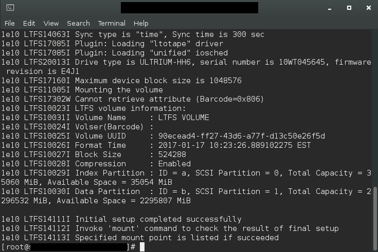
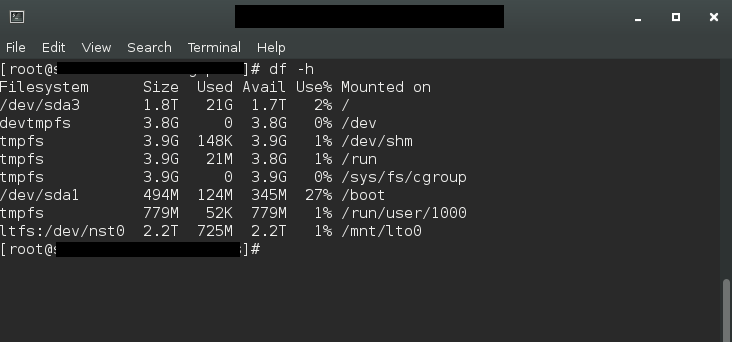
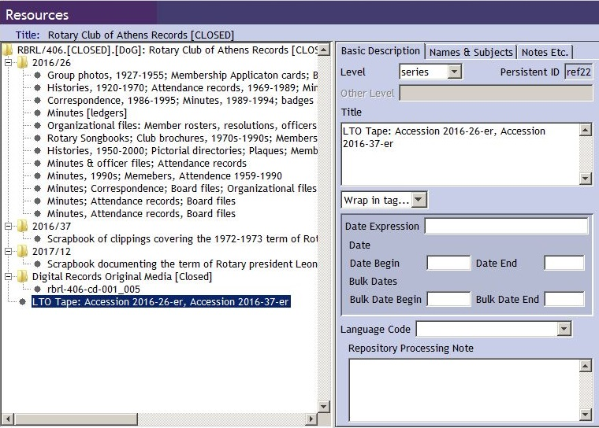
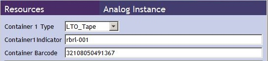
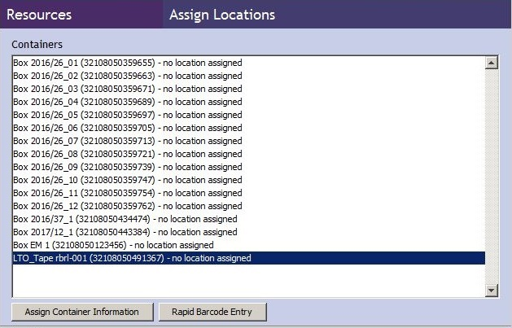
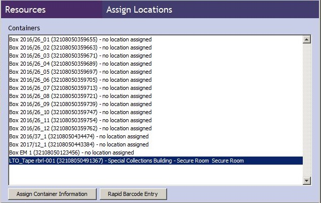

# Writing Files to LTO Tape

The following instructions are for writing to tape using the terminal. Prior to beginning these instructions, all files for an accession should be [copied to the machine](./lto-tape-machine.md) connected to the LTO tape drive and all processing work on them is complete. Unless it was too large, the accession will be in a bag.

Accessions should always be written either to two different LTO tapes, or to one LTO tape and to the RAID drive on the Linux Tape Machine, to provide a backup in the event of tape failure. LTO tapes are considered temporary preservation storage. Once all accessions on a tape have been processed, the tape can be reformatted and used again.

LTFS (file system) is not a uniform standard - there are variations for each vendor. So stay with the same manufacturer if possible to make for a smooth transition when copying from one tape to another.

## Tape Name

The tape name is written on a label attached to the tape itself. The tape name includes the code for the repository (Hargrett or Russell) and a sequential number with two leading zeroes.(e.g., harg-001 and rbrl-001).

## Tape Storage

One copy is stored in the 3rd floor secure room and the other in the vault. LTO tapes can be sent to the vault in their cases - they do not need to be in archival boxes. Do not send to the vault until the tape is full.

LTO tapes have a UGA barcode on the tape container for tracking their location. Put the barcode on the thin side of the container.

## Procedures:

### 1. Change to root

The LTO server in the Digital Archives Processing Area can only communicate with the LTO Drive when it has root permissions.

`$ su root`

If you get a permissions error, try putting `sudo` in front of the command.


### 2. Insert the LTO tape into the drive and mount the tape

`$ ltfs /mnt/ltfs`

Note that new, previously unused tapes must be formatted before they can be successfully mounted.

Various information will appear in the terminal as the tape is being mounted. Mounting is complete when the command prompt returns. It is successful if the last line above the prompt is "Specified mount point is listed if succeeded" - no mount point is listed, but that message means it worked.

   

Screen after `df -h` command:




### 3. Write the bag to tape using [rsync](./rsync.md)

`$ rsync -rlptog /path/to/bag /mnt/ltfs`  (copy one bag)

`$ rsync -rlptog -retc /path/to/bag1 /path/to/bag2 /mnt/ltfs`  (copy multiple bags at once)

Record this step in the [preservation documentation](./preservation-documentation.md).


### 4. Validate the bag on the tape

This checks that the bag(s) copied to the tape properly. When bags are large, this may take too long to be practical. In that case, restore a higher percentage of bags in Step 6 to the LTO tape machine and validate those bags on the LTO tape machine to test for copying accuracy.

`$ bagit.py --validate /mnt/ltfs/bag-name_bag`

Record this step in the [preservation documentation](./preservation-documentation.md).


### 5. Make tape manifest

Create a list of the filenames of all files on the tape and save with preservation documentation. Replace any manifests generated earlier with this more current version.

`$ ls -R /mnt/ltfs > /path/to/tape-name_manifest.txt`

It is not necessary to check if a previous manifest matches the more current one before overwriting it. In the unlikely event of a file corrupting on the tape, the bag manifests can be used to identify the problem.


### 6. Test restoring from tape

As a final quality control check, copy one of the bags from tape back to the LTO tape machine and make sure the files open. Delete from the LTO tape machine after testing.

`$ rsync -rlptog /path/on/tape /path/to/save`

If unable to validate bags on the tape in Step 4, copy a higher percentage of the bags back to the LTO tape machine and validate the bags on that machine to confirm that they copied properly. Validation is a much faster process on the machine.


### 7. Unmount the tape

Even though the terminal returns to the command prompt immediately, the tape is not yet fully unmounted. When the drive is quiet and the green light has stopped blinking it is safe to eject the tape using the blue button next to the drive.

`$ fusermount -u /mnt/ltfs`    


### 8. Write bag to a second LTO tape

Repeat steps 2-7 with a second LTO tape.

### 9. Update LTO tape inventory

Record summary information about the bag in the LTO Tape Inventory for both copies of the LTO tape.

All departments and units use a spreadsheet to track the contents of each LTO Tape, including backup tapes. There is one row of information for each bag or group of files on each tape. Use this spreadsheet to locate a file that needs to be restored and to make a rough estimate of how full a tape is.

All departments and units record some of the same information:    
* Tape name and barcode
* Digital object name: bag, group of files, or file
* Size: of the digital object, in gigabytes
* Date written to tape
* Who it was written to tape by
* Notes: for recording errors

### 10. Delete the bag from the LTO tape machine

`$ rm -rf /path/to/bag1 /path/to/bag2 `(delete multiple bags at once)


### 11. Add LTO tape to resource record in Archivists’ Toolkit

When unprocessed accessions are stored on LTO tape, include a reference to the LTO tape in the Archivists' Toolkit Resource Record so that when an archivist is ready to process the collection they will see that there are files on LTO tape without having to check the tape inventory.

The LTO Tape Inventory contains the authoritative information about what is on each tape. The second copy of the tape is indicated in the spreadsheet, but not in Archivists' Toolkit.

 * Put the tape at the series level after the list of accession numbers.

 *  For title, put LTO Tape: Accession Number(s)

    


* Create an analog instance for the LTO Tape:
    * Container 1 Type = LTO_Tape

    * Container 1 Indicator = tape number (e.g. rbrl-001)

    * Container Barcode = barcode assigned to tape

 

* Assign location for the tape

    * Open the record in the Yale plugin.

    * Highlight both the LTO tape in the "Containers" list and the correct location under "Locations."

    * Click "Add Location Link" (lower left button). The location will appear in the container list where it previously indicated "no location assigned". Then click done to save and finish.

 **Before assigning location:**

 

 **After assigning location:**

 


## Appendix: Common LTFS/LTO Tape Commands

Mount the tape  
```bash
    $ mkdir /Volumes/lto0
    $ ltfs -o device=0 /Volumes/lto0
```


Unmount the tape (cannot do this when terminal is in the ltfs directory)

```bash
    $ fusermount -u /mnt/ltfs
```


Format a tape before the first use


```bash
    $ mkltfs --device=0
```


Reformat the tape (deletes everything on it) - tape must be unmounted for it to work


```bash
    $ mkltfs -d /dev/st0 -f
```


Copy off tape to computer


```bash
    $ rsync -rlptog /mnt/ltfs/bag-name /place/to/save/to
```


View what is on the tape


```bash
    $ ls /mnt/ltfs  (list first level of folder titles)
    $ ls -R /mnt/ltfs  (list all folder and file titles)
    $ ls -l /mnt/ltfs  (list metadata along with title)
```


See all mounted storage (including the LTO tape) and approximately how full it is


```bash
    $ df -h
```


Calculate MD5 for contents of tape, change directory to tape and:


```bash
    $ find . -type f -exec md5sum {} \; > accession-number_manifest-md5.txt
```
