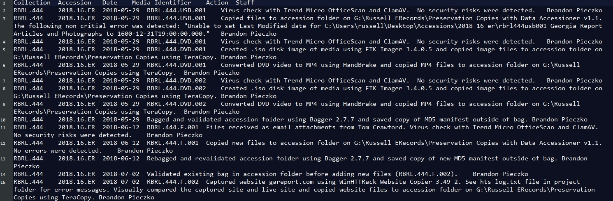

# Preservation Documentation

Hargrett and Russell A&D record every action taken on a group of files, organized by piece of media or by accession for files that are received electronically, in a preservation log. The documentation includes the action taken, tool used (if applicable), results of the action, and who performed the action.

There should be one preservation log per accession. The document is saved as a plain text, tab-delimited file (.txt) so we can later ingest all the documentation into a database that records preservation events for better use of the information.

This template was adopted prior to the University Libraries' implementation of [PREMIS metadata](https://www.loc.gov/standards/premis/). The information gathered was compared to PREMIS event metadata in 2017. The only information missing is an identifier and event type, both of which could be assigned once the metadata is ingested into a database. The "Action" field includes information that would be split into three PREMIS fields: detail information, outcome information, and agent (software). We will keep the current template for now so that all the metadata is structured consistently to facilitate ingest into a database, but  may split this field at a later date.

## Information Recorded

Each row should only have information about one action taken on a single group of files (typically all files from a single piece of removable media or single transfer). Record preservation actions as you work through the accessioning process so that the documentation is accurate and up-to-date.

This documentation covers events from acquisition through appraisal. During processing, add a final entry to indicate if a group of files was processed or separated. After that, preservation events are recorded in the processing documentation or by the preservation storage system.

* **Collection number:** use lowercase letters, numbers, and dashes (e.g., rbrl-272-ti). This is included in the text rather than relying on the file title or the folder the file is saved in so that we have all necessary identifying information if the record is ever ingested into a database.

* **Accession number:** use lowercase letters, numbers, and dashes (e.g., 2010-62-er).  This is included in the text rather than relying on the file title or the folder the file is saved in so that we have all necessary identifying information if the record is ever ingested into a database.

* **Date:** format YYYY-MM-DD. For actions that span more than one day, record the date the process finished.

* **Media Identifier:** unique ID for the media the action was taken on ([Digital Media Identifier](./digital-media-identifier.md)).

* **Action:** include a description of the action, the software or hardware used to complete the action (if applicable), and the result. When applicable, use the standard language provided below to describe an action and its outcome.

* **Staff:** name of the staff person who performed the action.

    ### Sample Preservation Log

    

## Examples of Standardized Language Used

### Virus Scanning

*   Virus check with Trend Micro OfficeScan 10.5.1997. No security risks were detected.

*   Virus check with Trend Micro OfficeScan 10.5.1997. The following files were identified as viruses: _[list file path and name]_.

*   This media contains a virus and does not have high research value. The media was securely destroyed.

*   _[filename]_ was identified as containing a virus. After research, it was determined that this was a false positive. The file can be copied and the file extension will be changed to _[whatever use]_ so that the file will no longer be identified as a virus.

*   _[filename]_ was identified as containing a virus. After research, it was determined that this is likely a virus. Other files on this disk do have high research value. When these files are copied from the media, _[filename]_ will be excluded from copying.

### Copying

*   Copied files from _[source]_ to _[location]_ using _[software]_. No errors were detected.

    *   Common sources: transfer media, SAN

    *   Common storage locations: accession folder in Russell ERecords, LTO tape machine, LTO tape _[number]_

    *   Common software: TeraCopy, rsync, Data Accessioner. Include the version number as well.

*   Copied files from _[source]_ to _[location]_ using _[software]_.  The following errors were detected: _[describe errors]_

### Bagging

*   Bagged with accession _[accession number]_ using bagit.py. No errors were detected.

*   Validated bag for _[accession number]_ using bagit.py. The bag was valid.

### Appraisal (of previously copied files)

*   No files were kept from this disk after appraisal. The files were deleted from _[preservation location]_ and the media was securely destroyed.

### Processed

*   This media was processed. Any further preservation actions taken on these files will be in the preservation documentation or preservation storage system.

    * Note that this field was not used in preservation documentation until May 2017. Prior to that, if a disk was processed, the last entry in the preservation documentation will be related to successful copying. The only additions made to the preservation documentation were if all files from a disk were separated during processing. This note was added so that, in either case, there was a clear indication about what happened to each group of accessioned files.
