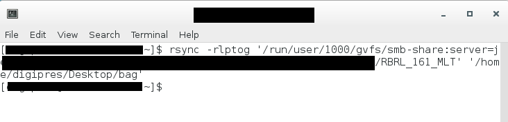
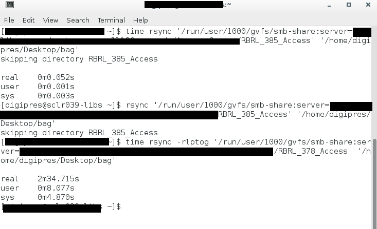

# rsync

[rsync](https://linux.die.net/man/1/rsync) is a command line tool for securely copying files on Mac or Linux machines.

## Procedures

### 1. Enter command into terminal

Copy single directory:

  `$ rsync -rlptog /path/to/files /path/to/where/saving it`

Copy multiple directories:

  `$ rsync -rlptog /path/to/files1 /path/to/files2 /path/to/files3 /path/to/where/saving`

### 2. rsync copies the files

By default, while the command is running, the cursor blinks. When it is finished, the command prompt returns. Adding the `--progress` option after the `rsync` command will make the terminal output more verbose during the copying process.  

rsync after it is finished copying:

### 3. Record results in [Preservation Documentation](./preservation-documentation.md)

As long as no error message appears, the copying was successful.

## Syntax Explained

`$ rsync -options /path/to/files '/path/to/where/saving it'`

If there are spaces in the file paths, put the file path in single quotes. To make sure that the file path is accurate, you can drag a folder onto the terminal window and it will generate the file path for you (with single quotes, regardless of if there are spaces or not).

For example, to copy the folder Stuff from My Docs to Desktop using the default options:

`$ rsync -rlptog '/home/user/My Docs/Stuff' '/home/user/Desktop/Stuff'`

    Default options we most commonly use with rsync:

        -r	recursive

        -l	copy symlinks as symlinks

        -p	preserve permissions

        -t	preserve modification times

        -o	preserve owner    

        -g	preserve group

## Time How Long It Takes to Copy (optional)

To find out how long it took to copy, add `time` before the `rsync` command. After the command runs, it will display the number of minutes it took to run the command in the terminal.

`$ time rsync -options /path/to/files /path/to/where/saving`

