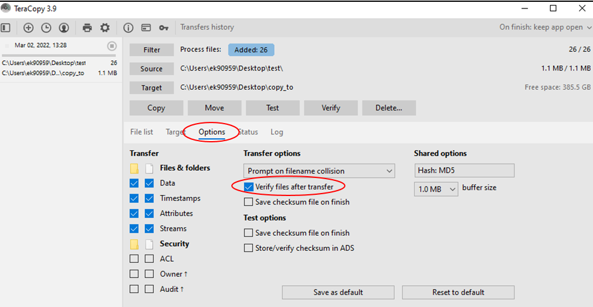
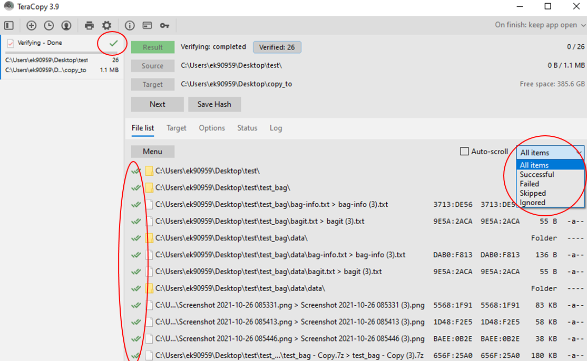

# TeraCopy

## Overview

[TeraCopy](https://www.codesector.com/teracopy) is a piece of free software created by Code Sector. It allows users to quickly move or copy large numbers of files, pause and restart transfers as needed, and verify the integrity of copied files. 

Verifying a file’s integrity means making sure no accidental changes occurred when the file was copied or moved. TeraCopy does this using hashes. A hash is an algorithmically-generated string of characters that serves as a kind of “fingerprint” for a digital file – if something changes within that file, even at the bit level where the change may not be visible, the file’s hash value will change completely. The “verification” setting in TeraCopy generates a hash for the original file, copies or transfers that file, then generates a second hash and compares the two. If the file was accidentally altered during the transfer process, the two values will be different and TeraCopy will flag the error. 

TeraCopy with verification should be used whenever digital collections materials are moved or copied.

## Instructions

### 1. Open the TeraCopy application and select “File list.”
It usually opens to this view by default.

### 2. Click on “Source” to select a source folder.
Alternatively, drag and drop the files you want to copy into the space where it says “Drag files or folders here.” The source field will auto-populate.

### 3. Click on “Target” to choose the destination (where the files will be moved or copied to).

### 4. Select “Options” and check “Verify files after transfer.”

### 5. Check the transfer results.
When the transfer is complete, the interface will display double green checks for verified files and a red “X” for any errors. It will also display a green check in the job queue on the left if the transfer went smoothly. If there were any errors, you can choose from the dropdown on the right side to show only the files that had problems.

