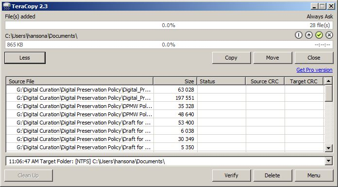
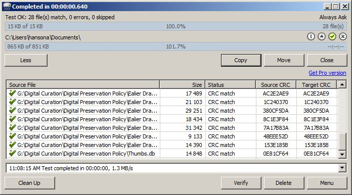

# TeraCopy

[TeraCopy](https://www.codesector.com/teracopy) is tool for reliably copying files on Windows and Mac OSX machines. TeraCopy checks the CRC (Cyclic Redundancy Check) hash value of each file before and after copying to ensure the files have been copied correctly. It is lightweight, simple tool used to copy files quickly and accurately.

## 1. Select files to copy
Drag and drop the files to be copied onto the TeraCopy window. Click "More" to show the Source File window, which will display a list of the file names.

## 2. Configure to verify fixity after copying

The check mark icon on the right side of the screen should be green. This indicates that fixity will be validated for each file during the copying process. Click it if it is not.

## 3. Select where to copy files to

Click "Select target folder" and browse to correct folder.

## 4. Copy the files

Click the "Copy" button. The button will read "Copy To" until you select a folder in Step 3.

## 5. Copying Results

After copying is complete, a message at the top left of the interface indicates how many files matched (were copied correctly), had errors, or were skipped. There will be a green check with a plus icon in the Source File column next to any file that copied correctly. Click the "Clean Up" button in the lower left to only show errors in the Source File window.

