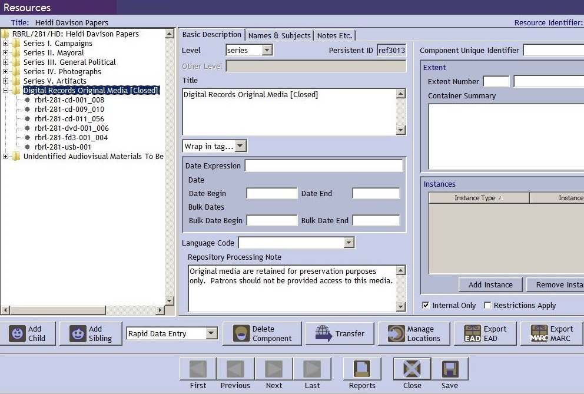
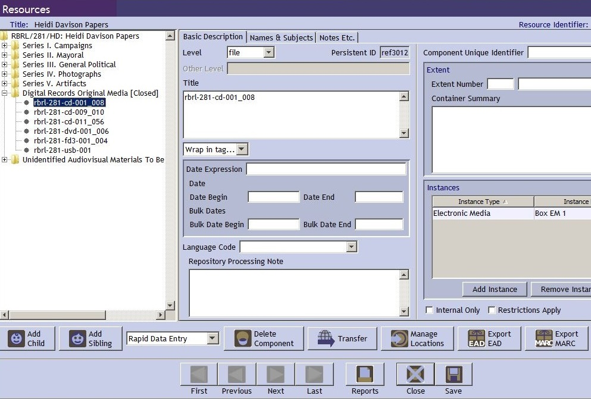
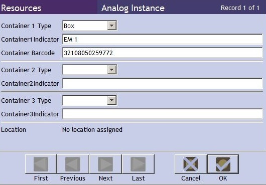

# Storing Transfer Media

All original transfer media will be retained and stored in the vault until after processing is complete in case errors are discovered. For example, audiovisual or interactive disks may appear to have copied properly during accessioning, but may actually require disk imaging or specialized copying methods to capture all the content or functionality.

## 1. House the transfer media

* Use a records center box to store transfer media. A single box can include media of any type and from any collection.

* On the box label, include a note that the box needs to be acclimated when retrieved.

## 2. Record location in Archivists' Toolkit resource record

* Create a series named "Digital Records Original Media [Closed]." Mark the series as "internal only" so that it does not appear in the online finding aid. This series should remain in the resource record even after the papers are processed for as long as the media is retained. It can be deleted once all media has be destroyed.  

* In the repository processing note, include this text: "Original media are retained for preservation purposes only. Patrons should not be provided access to this media."

    

* List the media as children of the series

    * Level should be “file.” The digital media identifier will serve as the title. For a group of media of the same type with consecutive numbers that are located in the same box, list as a single title with the identifier range, for example rbrl-281-cd-001_008.

    

* Create an analog instance (with "Electronic Media" as the type) for each list of digital media identifiers to indicate the box where they are located.

    * Use all Container 1 fields: Type is "Box", Indicator is the box number, and be sure to include the barcode. Put “EM” before the box number so when someone runs the "Manage Locations" report for the entire resource record it is clear which boxes contain digital media.

    
